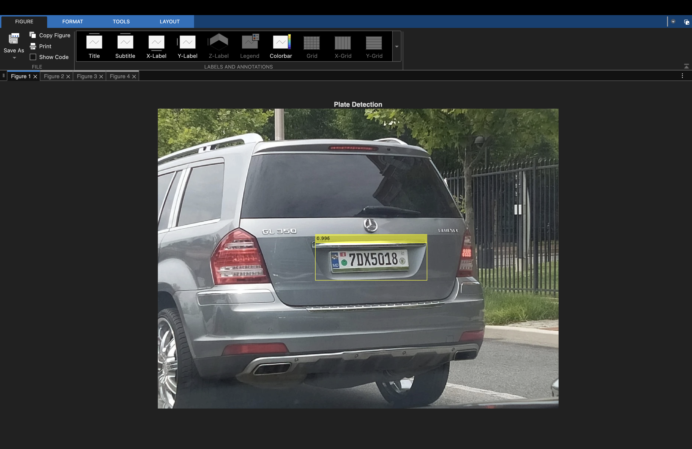
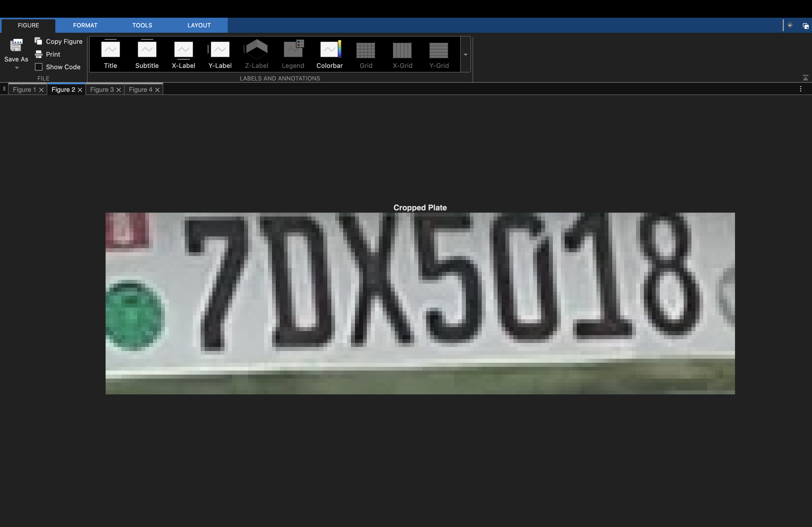
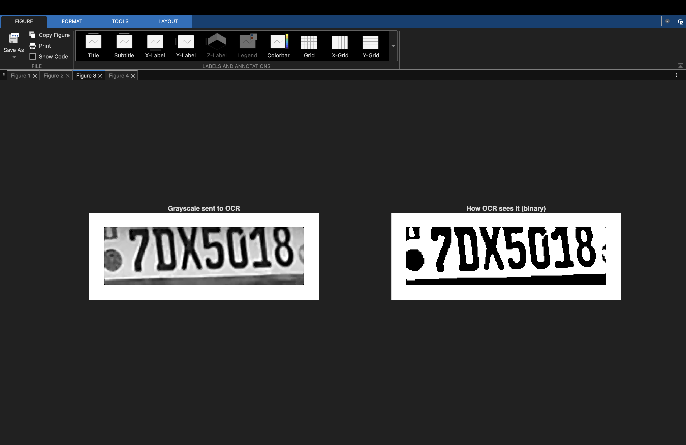
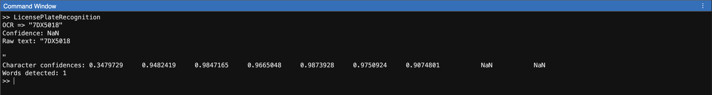
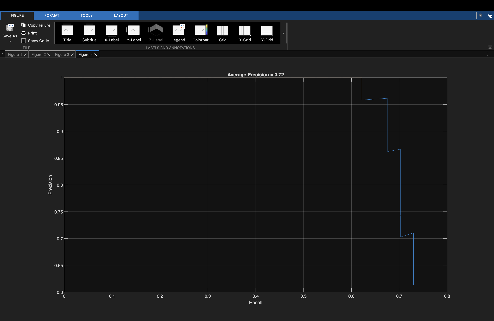

# License Plate Recognition Project

This project was trained on approximately 200 images with corresponding bounding boxes using the YOLOv4-Tiny model. The system detects license plates in images, enhances the detected plate region, and applies Optical Character Recognition (OCR) to extract the plate characters.

The model achieves an Average Precision (AP) of 72% with a maximum recall of 80%, which is strong performance given the limited dataset size.

## Limitations

The model tends to struggle with noisy images, glare, and vehicles that are not oriented straight-on. Due to the nature of OCR, visually similar characters (such as `6` and `G`) may occasionally be misclassified. Despite these challenges, the system performs reliably on well-lit, front-facing vehicle images.

## How to Run
1. Open `LicensePlateProject.prj` in MATLAB. Make sure to open through the project tab. If you need to check if the project is open, after importing, just double click LicensePlateProject.prj
2. Right click the code folder->Add to Path->Selected Folder(s) and Subfolders
3. Run `LicensePlateRecognition' in MATLAB Command Window.
4. Optional: Add addition images to test folder and update the "testImg" on line 212

## Folder Structure
- `code/` — main scripts and helper functions  
- `assets/` — dataset images  
- `data/` — output or experimental data  
- `tests/` — test images 

## Notes
- Requires Image Processing Toolbox.
- Uses `projroot.m` to ensure relative paths work on all systems.
- 3 images in test folder to use.

## Screenshots

### Plate Detection

### Cropped Plate

### Enhanced Plate

### Plate Output

### AP Score

